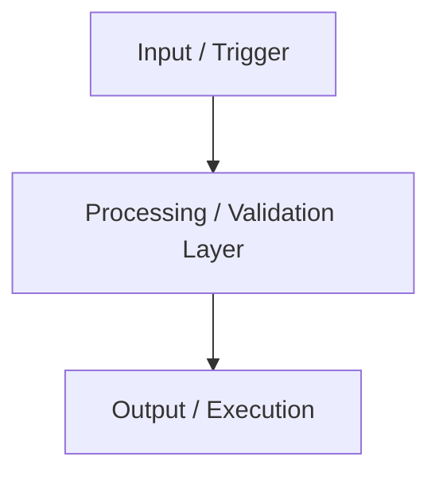

## 🎯 Purpose & Context
<!-- Provide a concise executive summary of what problem this PR solves or feature it introduces -->

## 🏗️ Architecture & Flow (Mermaid Diagram)
<!-- Optional: Add a mermaid diagram if architectural or procedural changes were made -->

## 📦 Key Changes by Scope
- **`scope/feat`**:
- **`scope/fix`**:
- **`scope/docs`**:

## 🧪 Validation & Quality Gates
- [ ] Local tests pass (`bash test/git-poule-test.sh && bash test/install-test.sh && bash test/site-test.sh`)
- [ ] Checked sound fallbacks on non-macOS or without audio players
- [ ] No regression on exit status codes
